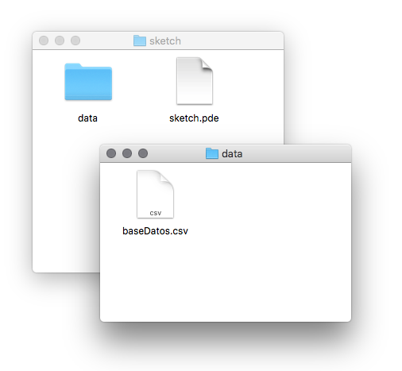
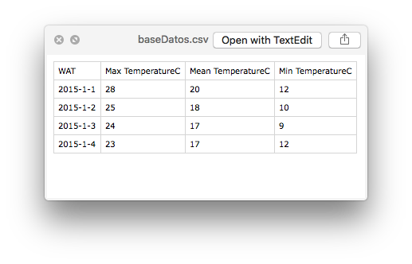
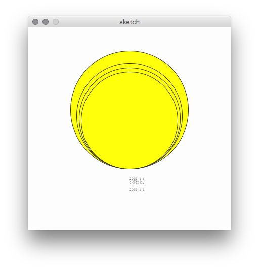

Universidad del Desarrollo - Facultad de Diseño - Diseño Digital - 6to semestre - Expresión Digital II

#### Leer bases de datos

------

Para leer una base de datos se necesita:

1. Almacenar la base de datos en una carpeta `/data` dentro de la carpeta principal
2. Identificar la cabecera de la base de datos y el tipo de dato que describe
3. Crear un `array` de objetos del mismo tamaño de la base de datos
4. Iterar por la base de datos y llenar el `array` con esa información, creando un objeto por dato

------

#### 1 Almacenar la base de datos en una carpeta `/data` dentro de la carpeta principal

Hasta ahora tenemos la siguiente estructura: `sketch/sketch.pde`, entonces la base de datos debe ser almacenada en `sketch/data/baseDatos.csv` 



------

#### 2 Identificar la cabecera de la base de datos y el tipo de dato que describe

Se necesita identificar **qué palabra** tiene la cabeza de cada columna y **qué tipo de dato** describe. Para luego hacer un par.




Sabiendo que el archivo tiene cabecera, lo debemos incorporar como parámetro al momento de cargar la base de datos en el objeto `Table tabla;` 


------

### 3 Crear un `array` de objetos del mismo tamaño de la base de datos


```java
// Array de objetos
Clase[] objetos;

Table tabla;

void setup() {
  // cargar la base de datos con el parámetro de cabecera
  // no es necesario la ruta /data, Processing lee por defecto
  tabla = loadTable("baseDatos.csv", "header");

  // inicalizamos el array con la cantidad de filas del archivo
  int total = tabla.getRowCount();
  objetos = new Clase[total]; 

  // lo mismo se puede escribir en una línea de código
  objetos = new Clase[tabla.getRowCount();]; 

  ///   4    /////////////////////////////////////////////////////////////////////////////////////
  // Iterar por la base de datos y llenar el array con esa información, creando un objeto por dato
  ////////////////////////////////////////////////////////////////////////////////////////////////

  // Con un contador podemos pasar por cada fila del archivo
  for (int i = 0; i < tabla.getRowCount(); i++) {
	// Creamos un nuevo objeto del tipo TableRow con la información de cada fila
    TableRow row = tabla.getRow(i);

	// Con el, podemos ir a los métodos para hacer paridad entre el dato y el constructor			// La paridad debe ser exacta en caracteres
	// Una variable del constructor - por cada variable del dato (que queramos)
    String fecha = row.getString("WAT");
    int maxima = row.getInt("Max TemperatureC");
    int minima = row.getInt("Min TemperatureC");
    
    // Con esas variables construyo un objeto
    objetos[i] = new Clase(fecha, maxima, minima);
  }
}

//-----------------------------------------------------------------------------------//
class Clase {
  String fecha;
  int maxima, minima;

  Clase(String fecha, int maxima, int minima)) {
    this.fecha = fecha;
    this.maxima = maxima;
    this.minima = minima;
  }

  void funcion() {
    
  }
}

```


------

### Usar los objetos como siempre.

```java
void draw() {
	background(253);
	// Uso de los objetos como siempre
	 for (int i = 0; i < objetos.length; i ++) {
	   objetos[i].funcion();
	}
}
```



